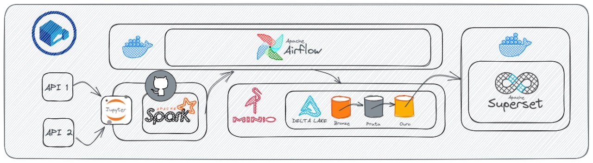

> ## Etapa atual: inicio 09/11/2023
> # Desafio Dados2Dados: Criando uma pipeline Delta Lake
> 

>## STATUS: Em andamento.
**Sobre o dessenvolvimento:**
Foi desenvolvido um script apartado no contexto do diretório **transient** para a extração de dados, juntamente com uma DAG que executa esse script diariamente. Além disso, criei um script apartado no contexto do diretório **raw** para converter o JSON armazenado no diretório **transient** em formato Delta, uma DAG agendada também foi implementada para executar esse script a cada 5 dias.

#### Requisitos:
- Realizar instalação do WSL se estiver no Windows;
- Instalar Docker;
- Instalar MinIO;
- Instalar jupyter/pyspark-notebook;
- Instalar airflow.

**Objetivo deste desafio é construir um Delta Lake e a sua pipeline utilizando os dados da API [OpenWeathermap](https://openweathermap.org/api);**

**Teremos 4 etapas:**

✅- A camada transient, que é a camada de extração (json, avro, csv, txt etc);

✅- Uma apenas de pegar os dados extraídos e convertidos para delta que seria a raw, aqui os dados são apenas convertidos para parquet delta;

-A trusted que é a camada onde vai ser feito os tratamentos da tabela, tratamento seria, transformações (conversão de data, tratamento de nulos etc);

-A camada refinada onde serão feita toda regra de negócio!

**O script de extração que está no airflow, ele sai de lá e vai para um script apartado ficará num bucket apenas para script, com a seguinte estrutura de pastas:**

✅- **transient:**
   - spark.

✅- **raw:**
   - spark.

-**trusted:**
   - spark.

-**refined:**
   - spark;
   - sql.

Obs: O script de transient será o único que terá mais códigos Python, os demais serão 95% pyspark.
#
#

> ## Etapa Inicial: 26/10/2023 a 01/11/2023
> # Desafio Dados2Dados: Consumindo API de tempo e temperatura com Python e SQL
> https://colab.research.google.com/gist/ricosuhete/6b97ce298620912687fc985892a52144/api_openweathermap.ipynb
> ## STATUS: Desafio Atendido, aguardando refatoração.

## Nota Importante

Este projeto aborda um desafio específico de obtenção de dados climáticos da API openweathermap, no entanto, é importante observar o seguinte:

- Foi instalado o Apache Airflow numa VM WSL usando o docker-compose e criando uma imagem personalizada;

- Para solucionar problemas técnicos, foram criadas duas DAGs no Apache Airflow. Uma DAG é executada diariamente para coletar dados climáticos atuais, enquanto a outra é executada a cada 5 dias para coletar previsões do tempo para os próximos cinco dias.

- Ambas as DAGs coletam dados para as cidades de Curitiba, Pinhais, Colombo e Londrina, localizadas no estado do Paraná, Brasil.

- Os dados coletados são armazenados em formato Delta Lake, em um bucket chamado "desafiotempo", com diferentes caminhos: "transient/daily_historic" para dados atuais e "transient/forecast_historic" para previsões futuras.

É importante destacar que, no momento, o histórico de dados disponíveis não abrange um período de 30 dias completos. Portanto, os resultados obtidos com a execução do código podem não atender às expectativas em relação a um intervalo de 30 dias. No entanto, à medida que mais dados históricos são coletados, será possível executar o código com um período de 30 dias e obter resultados mais precisos.

> ## Primeiros problemas apontados:

✅- Obter a temperatura atual para uma lista de cidades do seu estado e armazenar os resultados em uma tabela SQL.

✅- Analisar a temperatura máxima e mínima para cada cidade em um período de 30 dias e exibir os resultados em uma tabela SQL.

✅- Determinar a cidade com a maior diferença entre a temperatura máxima e mínima e exibir o resultado em uma tabela SQL.

✅ - Identificar a cidade mais quente e a cidade mais fria em um período de 30 dias e exibir os resultados em uma tabela SQL.

✅ - Calcular a média da temperatura para cada dia em um período de 30 dias e exibir os resultados em uma tabela SQL.

✅ - Identificar as cidades com as maiores e menores variações de temperatura em um período de 30 dias e exibir os resultados em uma tabela SQL.

✅ - Obter a previsão do tempo para uma lista de cidades do seu estado nos próximos 7 dias e armazenar os resultados em uma tabela SQL.

✅- Identificar a cidade com a maior quantidade de dias chuvosos em um período de 30 dias e exibir o resultado em uma tabela SQL.

✅ - Calcular a média de umidade para cada dia em um período de 30 dias e exibir os resultados em uma tabela SQL.

✅ - Identificar as cidades com a maior e menor umidade média em um período de 30 dias e exibir os resultados em uma tabela SQL.